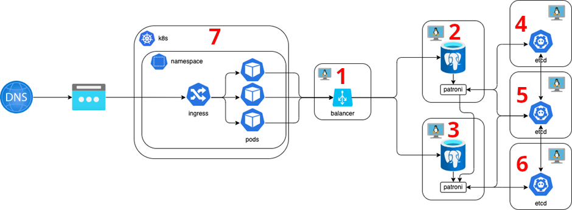
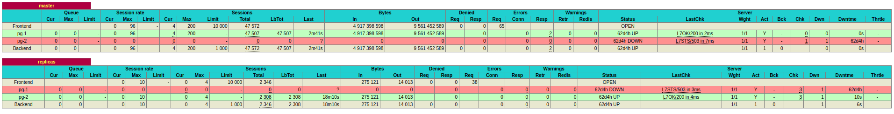

# Chaos Engineering
 
Для удобства описания экспериментов по CE (Chaos Engineering) 
разметим цифрами (красным шрифтом) основные узлы тестируемой системы




## Подготовительные работы

### Установка инструмента CE
В качестве инструмента CE выбран [ChaosBlade](https://chaosblade.io/).


Установим на каждую ноду (1 - 6) ChaosBlade согласно документации
https://chaosblade.io/en/docs/getting-started/installation-and-deployment/tool-chaosblade-install-and-uninstall
выполнив на каждой из нод

```console
wget https://github.com/chaosblade-io/chaosblade/releases/download/v1.7.2/chaosblade-1.7.2-linux-amd64.tar.gz
tar -xvf chaosblade-1.7.2-linux-amd64.tar.gz && cd chaosblade-1.7.2/
```

### Подготовка нагрузки на БД

Т.к. наш стенд тренировочный и не используется никак в реальном времени, 
необходимо сымитировать запись или обновление в базу во время CE экспериментов с мастером и репликой PG-кластера.

Во время нагрузочного тестирования нагружалось только чтение, т.к. запись и обновление считались относительно редкими операциями, 
но воспользовавшись тем же инструментом (k6) можем написать вспомогательный скрипт для небольшой нагрузки записи в базу

https://github.com/alexandr-chumakov/mts-course-sre-ht/blob/master/scripts/forecast_post.js

## Описание экспериментов

#### 1. Отключение master узла patroni.
Сымитируем процесс отключения master узла командой blade полной потери сети на 5 минут.
Чтобы фиксировать время, добавим вызов команды date в начало эксперимента
```console
date; sudo ./blade create network corrupt --percent 100 --interface ens160 --timeout 300
```
Наблюдать за переключением будем в графане и через стат-борд HAProxy, который по умолчанию на 7000 порту
http://IP_HA_Proxy:7000/stat
в нормальном состоянии выглядит как рисунке ниже (pg-1 -- master, pg-2 -- replica)


2. Отключение реплики узла patroni.
3. Отключение узлов etcd
4. Отключение узла балансировки нагрузки с целью пронаблюдать как поведёт себя слой приложения.
5. 
6.
7.


## Результаты и выводы

| №  | Ожидание                       | Результат                                                                                                         |
|----|--------------------------------|-------------------------------------------------------------------------------------------------------------------|
| 1  | Переключение реплики на мастер | Получен ожидаемый результат. Стат-борд HAProxy и patroni exporter на графане отобразили смену мастера оперативно. |
| 2  |                                |                                                                                                                   |
| 3  |                                |                                                                                                                   |
| 4  | Выдача 503 ошибки              |                                                                                                                   |


