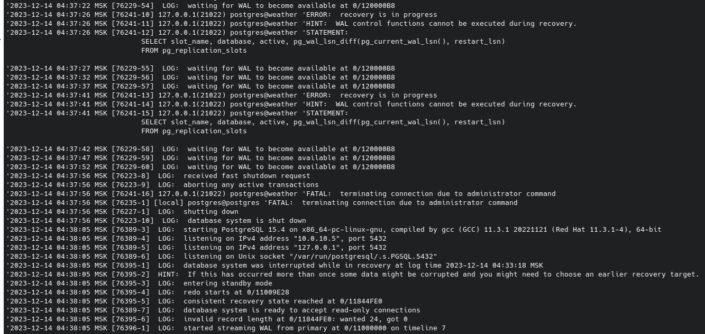

# Chaos Engineering
 
Для удобства описания экспериментов по CE (Chaos Engineering) 
разметим цифрами (красным шрифтом) основные узлы тестируемой системы


## Подготовительные работы

### Установка инструмента CE
В качестве инструмента CE выбран [ChaosBlade](https://chaosblade.io/).


Установим на каждую ноду (1 - 6) ChaosBlade согласно документации
https://chaosblade.io/en/docs/getting-started/installation-and-deployment/tool-chaosblade-install-and-uninstall
выполнив на каждой из нод

```console
wget https://github.com/chaosblade-io/chaosblade/releases/download/v1.7.2/chaosblade-1.7.2-linux-amd64.tar.gz
tar -xvf chaosblade-1.7.2-linux-amd64.tar.gz && cd chaosblade-1.7.2/
```

### Подготовка нагрузки на БД

Т.к. наш стенд тренировочный и не используется никак в реальном времени, 
необходимо сымитировать запись или обновление в базу во время CE экспериментов с мастером и репликой PG-кластера.

Во время нагрузочного тестирования нагружалось только чтение, т.к. запись и обновление считались относительно редкими операциями, 
но воспользовавшись тем же инструментом (k6) можем написать вспомогательный скрипт для небольшой нагрузки записи в базу

https://github.com/alexandr-chumakov/mts-course-sre-ht/blob/master/scripts/forecast_post.js

## Описание экспериментов

#### 1. Отключение master узла patroni.
Сымитируем процесс отключения master узла командой blade полной потери сети на 5 минут.
Чтобы фиксировать время, добавим вызов команды date в начало эксперимента
```console
date; sudo ./blade create network corrupt --percent 100 --interface ens160 --timeout 300
```
Наблюдать за переключением будем в графане и через стат-борд HAProxy, который по умолчанию на 7000 порту
http://IP_HA_Proxy:7000/stat
в нормальном состоянии выглядит как рисунке ниже (pg-1 -- master, pg-2 -- replica)


После запуска теста получен ожидаемый результат смены реплики на мастер. 
Стат-борд HAProxy и patroni exporter на графане отобразили смену мастера оперативно.


#### 2. Отключение узла patroni при записи в БД (~10 rps).
Слегка нагрузим кластер операциями записи, запустив подготовленный k6 скрипт, одновременно "отключив" реплику, чтобы при её восстановлении существовали новые данные, которые необходимо синхронизировать.

Во время нагрузки сымитируем проблему сети на 5 минут той же командой
```console
sudo ./blade create network corrupt --percent 100 --interface ens160 --timeout 300
```
Судя по логу
```console
sudo less /var/log/postgresql/postgresql-Thu.log
```

После имитации потери сети восстановление репликации заняло чуть более 40 секунд.

### 3. Частичная потеря сети

Сымитируем 30% потерю сети у реплики и пронаблюдаем как она отстанет от мастера за 10 минут при небольшой (~10 rps) нагрузке на запись
```console
sudo ./blade create network corrupt --percent 30 --interface ens160 --timeout 600
```

Перед запуском теста проверим текущим статус нод
```console
sudo /usr/local/bin/patronictl -c /etc/patroni/patroni.yml list
```
Видим, что на текущий момент мастер у нас pg-2. Значит тест запустим на pg-1.
```
+ Cluster: postgres-cluster ---+-----------+----+-----------+
| Member | Host      | Role    | State     | TL | Lag in MB |
+--------+-----------+---------+-----------+----+-----------+
| pg-1   | 10.0.10.5 | Replica | streaming |  7 |         0 |
| pg-2   | 10.0.10.6 | Leader  | running   |  7 |           |
+--------+-----------+---------+-----------+----+-----------+
```

В начале теста было замечено отставание реплики (~ 8 сек).


При этом лаг патрони сначала вырос, а затем восстановился ещё до завершения теста (!), когда ожидалось, что лаг всё-таки восстановится после окончания имитации потери сети.


### 4. Тесты высокой нагрузки на CPU или I/O

Проведем на нодах etcd тесты высокой нагрузки RAM и CPU,  заодно проверим настроенный алертинг (warning на >80% от 10 мин., critical на > 90% от 5 мин. при показаниях больше 10 мин)

```console
sudo ./blade create mem load --mode ram --mem-percent 91 --timeout 301
```

нагрузка началась в 50 мин. 45 сек, но уже в 52 мин. 38 сек. появились алерты в состоянии pending


Запустим теперь тесты нагрузки CPU.

```console
sudo ./blade create cpu load --cpu-percent 81 --timeout 601
```

Алерт ожидался через 5 минут, но спустя время он так и не активировался.
Графана нагрузку показывала. Первая мысль при рассматривании графиков, что blade не держит нагрузку строго выше 81%, 
т.к. на графике графаны нагрузке флуктуировала ниже, а для вызова алерта необходимо держать соответствующую цифру выше порога определенное время.


Повторив тест со значением `--cpu-percent 89` алерт также не был вызван. 
Проверка конфига алертинга показало, что была ошибка в именовании job внутри promQL.
Поправив имя job, алерты активировались


## Выводы

Т.к. у нас всего один мастер и одна реплика, то стратегия выбора - простая смена ролей (при этом ново объявленная реплика недоступна из-за недоступности узла).
Нагрузки RAM и CPU (до 90%) на etcd ноды не приводили к смене лидера. Отключение ноды etcd приводит к четному кол-во etcd, о чем вовремя сигнализирует соответствующий алерт (images/etcd-even-number-alert.png).
Chaos Enegineering тесты также помогли обнаружить ошибку в настройке алертов на node_exporter для CPU.
